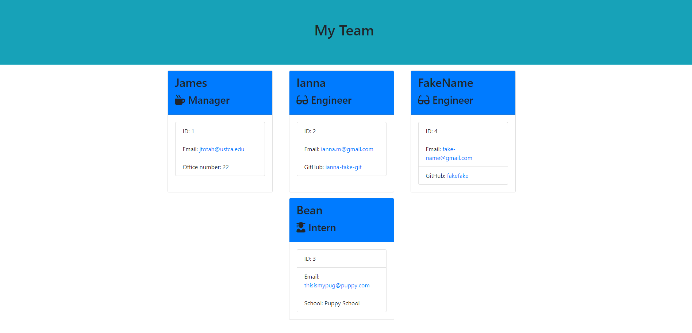

# Template-Engine---Employee-Summary

## Description
This project takes in user input from the command line and populates an html page with data on a programming team. A single manager card is generated from the data, as well as unlimited numbers of intern or engineer cards.

## Table of Contents
1. [Description](#description)
2. [Installation](#installation)
3. [Usage](#usage)
4. [License](#license)
5. [Contributing](#contributing)
6. [Tests](#tests)
7. [Questions](#questions)

## Installation
npm install

## Usage
run it using node, "node app.js" will work

## License
The MIT License

## Contributing
James Totah

## Tests
jest

## Questions

- Github Profile: [jtwob](https://github.com/jtwob)
- Email: jtotah@usfca.edu